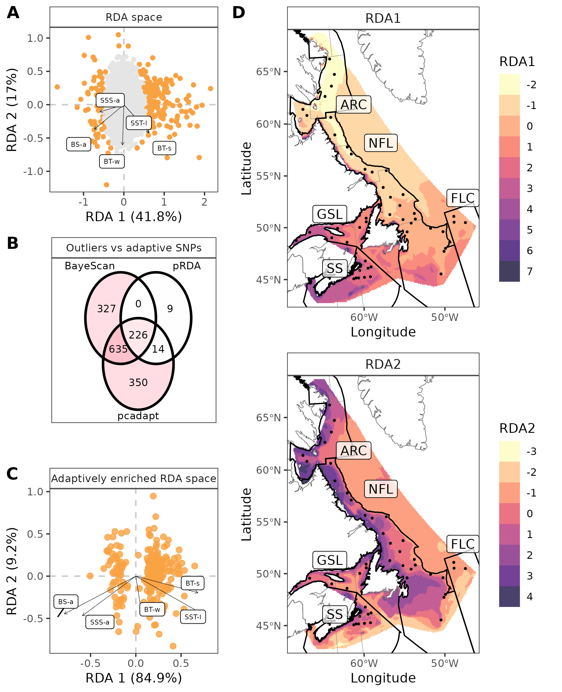

# R scripts, figures and results of the Northern shrimp population genomic MS
## Diving into large-scale  population genomics to decipher drivers of structure and climatic vulnerability in a marine invertebrate

__Main author:__  Audrey Bourret  
__Affiliation:__  Fisheries and Oceans Canada (DFO)   
__Group:__        Laboratory of genomics   
__Location:__     Maurice Lamontagne Institute  
__Affiliated publication:__ Bourret A, Leung C, Puncher GN, Le Corre N, Deslauriers D, Skanes K, Bourdages H, Cassista-Da Ros M, Walkusz W, Jeffery NW, Stanley RRE, Parent GJ (In preparation). Diving into large-scale  population genomics to decipher drivers of structure and climatic vulnerability in a marine invertebrate.  
__Contact:__      e-mail: audrey.bourret@dfo-mpo.gc.ca

- [Objective](#objective)
- [Summary](#summary)
- [Status](#status)
- [Contents](#contents)
- [Manuscript main figures](#manuscript-main-figures)
- [Requirements](#requirements)
- [Acknowledgements](#acknowledgements)

## Objective

Species with widespread distributions play a crucial role in our understanding of the implications of a changing climate on marine population structure. This later, often governed by connectivity potential and selection across strong environmental gradients, is expected to undergo significant alterations due to ongoing and persistent climate change. Despite the complexity of factors influencing population structure, studying species with broad distribution can provide valuable insights into the consequences of climate-induced alterations across environmental gradients. We used the northern shrimp *Pandalus borealis* and its wide latitudinal distribution to identify current drivers of population structure and predict the species vulnerability to climate change. Individuals sampled across 24 ° latitude were genotyped at high geographic- (54 stations) and genetic- (14,331 SNPs) resolutions to assess genetic variation and environmental correlations. Four populations were identified in addition to finer substructure associated to local adaptation. Geographic patterns of neutral population structure  reflected predominant oceanographic currents, while a significant proportion of the genetic variation was associated with gradients in salinity and temperature. Adaptive landscapes generated using climate projections suggest a larger genomic offset in the southern extent of the P. borealis range, where shrimp had the largest adaptive standing genetic variation. Our genomic results combined with recent  observations  point to the non-recovery in southern regions and an impending vulnerable status in the regions at higher latitude for *P. borealis*. They also provide rare insights into the drivers of population structure and climatic vulnerability of a widespread meroplanktonic species, which is crucial to understand future challenges associated with invertebrates essential to ecosystem functioning .

## Status
Ongoing-improvements

## Contents
### Folder structure

    .
    ├── OO_Data     # Folder containing data used for the analyses 
    ├── 01_Scripts  # R scripts  
    ├── 02_Results  # Main results      
    └── README.md

### Main scripts

[**00_Discovered_SNPs.R**](01_Scripts/00_Discovered_SNPs.R) From raw reads to genotyping with STACK.

[**01_Filter_SNPs.R**](01_Scripts/01_Filter_SNPs.R) Various filtration step to obtain the full SNP panel. 

[**02_Overall_PopGen.R**](01_Scripts/02_Overall_PopGen.R) All analysis (PCA, Admixture, EEM, RDA, genomic offset).

## Manuscript main figures

|  |
|:--:| 
| **Figure 2** Comparison of population structure of 1,513 *Pandalus borealis* individuals from 54 stations using the putative neutral (A,C,E) and outlier (B,D,F) SNP panels. |

|  |
|:--:| 
| **Figure 3** Estimated effective migration surface using the A) neutral and B) outlier SNP panels, combining the results from three independent MCMC iterations.  |

|  |
|:--:| 
| **Figure 4** Identification and characterization of candidate adaptative loci (panels A, B) and spatial extrapolation into adaptative landscape under present environmental conditions (panels C, D) in *Pandalus borealis*. |

|  |
|:--:| 
| **Figure 5** Exploration of *Pandalus borealis* vulnerability to climate change using A) the genomic offset, B) the adaptive standing genetic variation (aSGV), and C) their relationship. |

## Requirements
Raw sequence data for the *P. borealis* reference genome assembly, the ddRAD and the transcriptomic datasets are available in the Sequence Read Archive (SRA) under the BioProject accession PRJNA909194. 

## Acknowledgements
We are grateful to the Ministerio de ciencia e innovaccion and Instituto Espanol de oceanografia for sampling in Flemish Cap area and to the Northern Shrimp Research Foundation for collection of samples from the Arctic and Northern Labrador Shelf, as well as numerous Fisheries and Oceans Canada staff for collection of samples during their regular surveys. We thank F. Lefebvre and G. Leveque (C3G) for the reference genome advice and  assembly, and E. Parent, G. Cortial, J. Larivière, L.-A. Dumoulin, F. Paquin and A. Atikessé for laboratory work and sample coordination (DFO, Canada). We would also like to thank Claude Nozères for helpful discussions on crustacean meroplanktonic species inhabiting similar marine depths as *P. borealis*.

